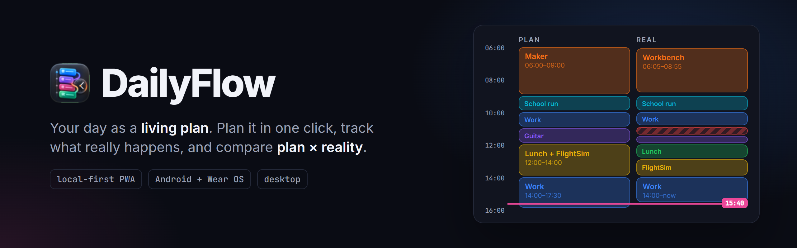
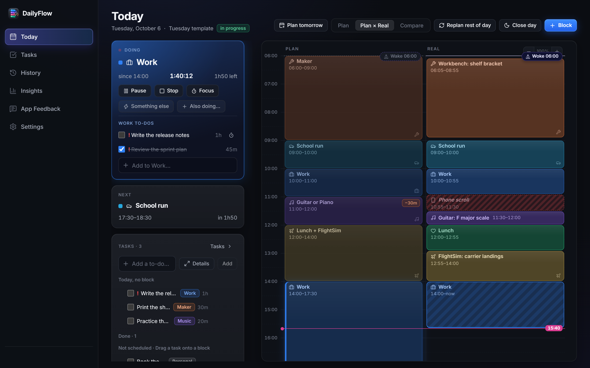
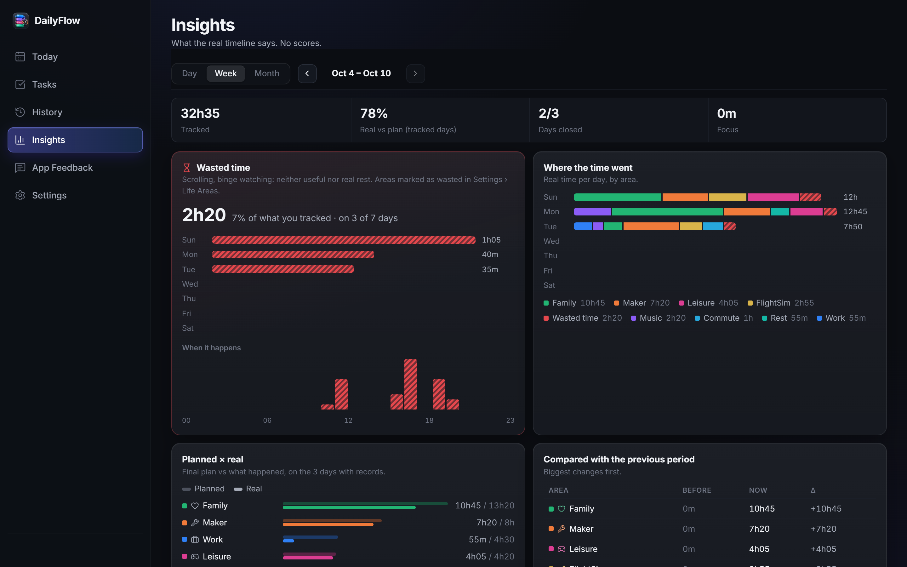
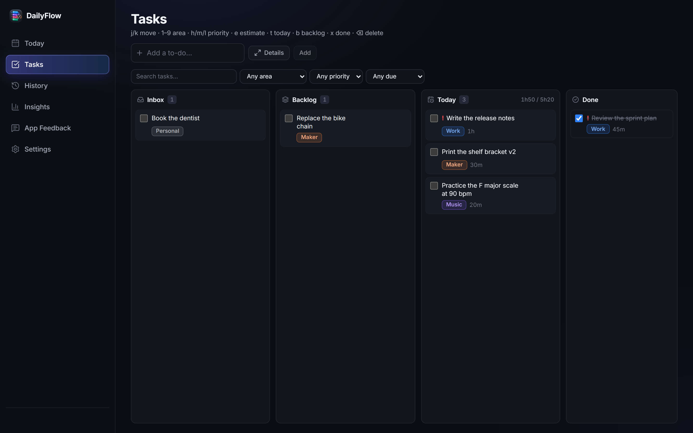
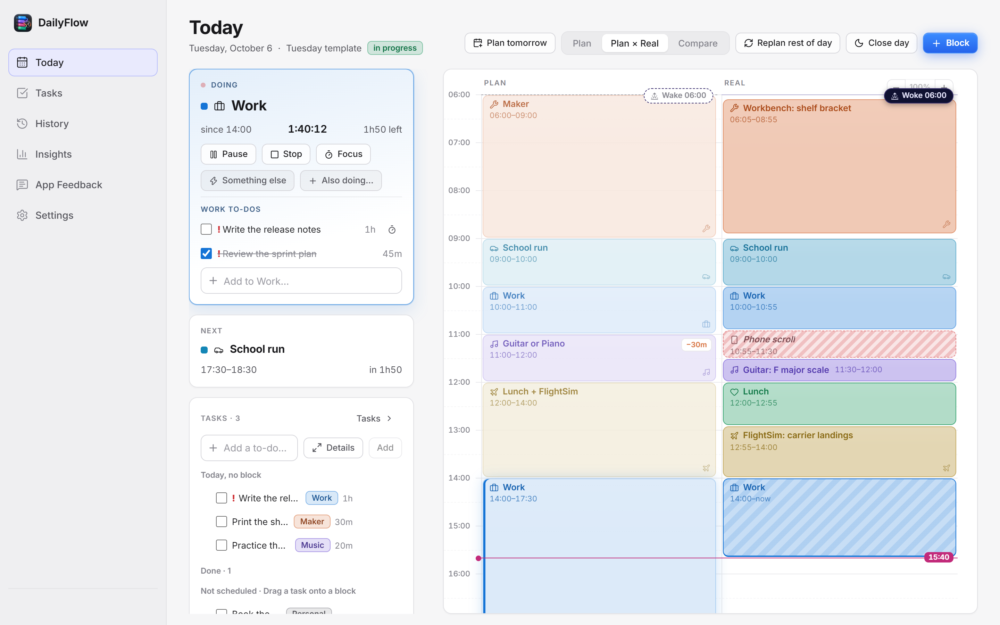

<div align="center">

<picture>
  <source media="(prefers-color-scheme: dark)" srcset=".github/assets/banner-dark.png">
  <source media="(prefers-color-scheme: light)" srcset=".github/assets/banner-light.png">
  
</picture>

<br>


<br><br>

**Personal time management where the day is a living plan, not a static calendar or a to-do list.**<br>
Plan it, live it, and see what actually happened next to what you planned.

[Features](#features) · [Screenshots](#screenshots) · [Getting started](#getting-started) · [Platforms](#platforms)

<br>



<sub>A fictional Tuesday: the plan on the left, what really happened on the right, wasted time striped in red.</sub>

</div>

<br>

## Features

|                              |                                                                                                                             |
| ---------------------------- | --------------------------------------------------------------------------------------------------------------------------- |
| 🗓️ **Plan in one click**     | Each weekday has its own template. Start the day as it is, plan it step by step, or start late from now.                   |
| ⏱️ **Track what is real**    | Now and Next, start, stop, pause, switch, and "also doing" for two things at once. Every second lands on the real timeline. |
| ⚖️ **Plan × reality**        | The plan stays frozen as a baseline. Compare it with the real timeline, replan the rest of the day, then close it.         |
| ✅ **Tasks that fit blocks** | Inbox, backlog, today and done, with keyboard shortcuts. Drag a task onto a block, or let it carry to the next day.        |
| 📊 **Insights, no scores**   | Where the time went, wasted time and when it happens, planned × real per area, and changes against the previous period.    |
| 😴 **Sleep and check-ins**   | Sleep from Health Connect or by hand, and a 20-second daily check-in about how honest the record is.                       |
| 📅 **Calendars**             | Google, Microsoft or any ICS link: events become blocks, and conflicts are flagged.                                        |
| 📴 **Local-first**           | Everything lives in IndexedDB and works offline, then syncs to Postgres. The newest write wins.                            |

## Screenshots

<table>
  <tr>
    <td width="50%"></td>
    <td width="50%"></td>
  </tr>
  <tr>
    <td align="center"><b>Insights</b> · what the real timeline says</td>
    <td align="center"><b>Tasks</b> · keyboard-first board</td>
  </tr>
</table>

<details>
<summary><b>Light theme</b></summary>
<br>

</details>

<sub>Every screenshot comes from a throwaway browser with fictional data and no server behind it.</sub>

## Platforms

| Folder     | What                                                                                                    | Status       |
| ---------- | ------------------------------------------------------------------------------------------------------- | ------------ |
| `web/`     | The app: Next.js 16 PWA, local-first (IndexedDB with Dexie) with sync to Neon Postgres                 | In daily use |
| `desktop/` | Electron companion: Now and Next floating in a corner, plus a tray / menu-bar icon                      | In use       |
| `mobile/`  | Android (Expo): a native shell around the web app, plus home-screen widgets, a lock-screen notification and OTA updates | In daily use |
| `wear/`    | Wear OS (Kotlin): complications for Now, Next and start/stop that plug into any watch face              | In use       |
| `design/`  | Design system, tokens, icon and visual reference                                                        |              |
| `review/`  | Living planning doc: stages, flows, wireframes and validation                                           |              |

Every feature lives in the web app; the native apps only add what a browser cannot do
(widgets, lock-screen notification, watch complications, a floating window). They talk to
`/api/sync` and `/api/snapshot` with a device token, paired from the web by QR code or an
8-character code. The product and functional spec is in
[`daily-os-product-functional-spec.md`](daily-os-product-functional-spec.md).

## Getting started

```bash
cd web
cp .env.example .env.local   # DATABASE_URL, ACCESS_CODE_HASH, SESSION_SECRET at least
npm install
npm run dev
```

| Command                         | What it does                                   |
| ------------------------------- | ---------------------------------------------- |
| `npm test`                      | Unit tests (Vitest)                            |
| `npm run hash-code -- "<code>"` | Hash for a new access code                     |
| `npm run typecheck`             | TypeScript                                     |

- **Database:** create a [Neon](https://neon.tech) project and run `web/db/schema.sql`.
- **Sign-in:** there are no accounts. Each device signs in once with the access code and
  gets a signed session; other devices are paired from Settings › Device.
- **Deploy:** Vercel with the root directory set to `web`.

<details>
<summary><b>Desktop companion</b></summary>

```bash
cd desktop
npm install
npm run dev        # points at http://localhost:3000
npm run dist:win   # Windows installer
```

</details>

## Stack

| Layer    | Technology                                                    |
| -------- | ------------------------------------------------------------- |
| Web      | Next.js 16 (App Router), React 19, TypeScript, Dexie, Lucide  |
| Data     | IndexedDB on each device, Neon Postgres as the sync hub       |
| Android  | Expo (WebView shell), react-native-android-widget, EAS Update, Health Connect |
| Watch    | Kotlin, Wear OS complications                                 |
| Desktop  | Electron                                                      |
| Tests    | Vitest                                                        |

<br>

<div align="center">
<sub>Built by <a href="https://github.com/megomes">Matheus Ervilha</a> to find out where his days really go.</sub>
</div>
