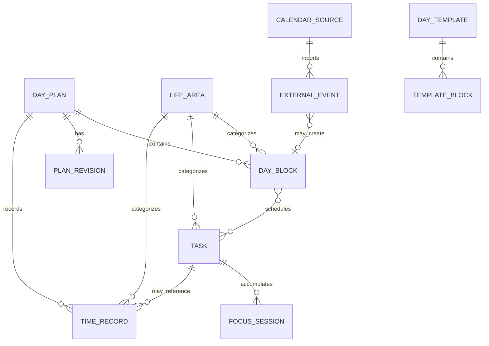

# DailyFlow — Product & Functional Specification

> **Status:** Product definition v0.1  
> **Primary platform:** Web/PWA first  
> **Secondary platforms:** Android app + Android widgets, later Wear OS  
> **User model:** Single-user personal software  
> **Core idea:** The day is a living plan — not a static calendar and not a todo list.

---

# 1. Product Vision

**DailyFlow** is a personal time-management system designed to help one person deliberately curate, allocate, execute, understand and continuously improve how time is spent.

The product combines:

- Daily planning
- Time blocking
- Task management
- External calendar awareness
- Calendar protection
- Focus/Pomodoro tracking
- Planned vs actual time
- Historical correction
- Statistics
- Behavioral/product analytics
- Progressive learning about how the user really uses the system

The main object of the product is not the task, project or calendar event.

The main object is:

> **Today.**

The user should be able to open the product and understand within seconds:

1. What was planned?
2. What is happening now?
3. What comes next?
4. What still needs to fit today?
5. What changed?
6. How was time actually spent?

---

# 2. Product Philosophy

This is not merely an app.

It is a **personal model for organizing and curating time**.

The product should evolve based on actual usage.

The development process must therefore assume:

- The initial workflow is a hypothesis.
- Some fields may prove unnecessary.
- Some features may be ignored.
- Some planning steps may create friction.
- Usage logs should help identify what to simplify.
- The model should evolve together with the user.

The product should never optimize for “maximum productivity”.

It should optimize for:

- Intentional use of time
- Awareness
- Realistic planning
- Easy adaptation
- Low friction
- Historical understanding
- Better future estimates
- Balance between different areas of life

---

# 3. Core Mental Model

The product follows this daily lifecycle:

```text
CAPTURE
   ↓
REVIEW CONTEXT
   ↓
PLAN
   ↓
ALLOCATE
   ↓
START DAY
   ↓
EXECUTE
   ↓
REPLAN WHEN NECESSARY
   ↓
RECORD REALITY
   ↓
REVIEW
   ↓
CLOSE DAY
   ↓
LEARN
```

The UI should make this lifecycle natural without forcing the user through unnecessary ceremony.

---

# 4. Primary Product Objects

The central domain objects are:

```text
Day
├── Baseline Plan
├── Current Plan
├── Actual Timeline
├── Plan Revisions
├── Blocks
├── Tasks
├── External Calendar Events
├── Time Records
└── Daily Review
```

Supporting objects:

```text
Life Areas
Projects
Categories
Tags
Pomodoro / Focus Sessions
Templates
Calendar Connections
Statistics
Product Usage Logs
```

---

# 5. The Day Is the Primary Object

The main experience is **Today**.

A `Day Plan` combines:

- Weekday or Weekend template
- Google Calendar events
- Microsoft work calendar events
- Manually created blocks
- Tasks scheduled into blocks
- Tasks not yet scheduled
- Current activity
- Actual time records
- Revisions made during the day

Tasks and calendars feed Today.

They do not replace Today.

---

# 6. Planning and Reality Must Be Separate

Never overwrite the original day plan when the day changes.

The system must preserve three distinct layers.

## 6.1 Baseline Plan

The plan accepted when the user starts the day.

Example:

```text
06:00–09:00 Maker
09:00–10:00 Drive / Leo
10:00–11:00 Work
11:00–12:00 Music
12:00–14:00 Lunch + FlightSim
14:00–17:30 Work
17:30–18:30 Drive / Leo
18:30–21:00 Family
21:00–22:00 Reading / Sleep
```

The Baseline Plan is immutable history.

---

## 6.2 Current Plan

The latest intended version of the day.

Example:

```text
11:00 Music moved to 13:00
11:30 meeting added
Lunch shortened
Work extended until 18:00
```

The Current Plan may change many times.

---

## 6.3 Actual Timeline

What actually happened.

Example:

```text
06:20–08:50 Maker
08:50–10:05 Commute / Leo
10:05–11:28 Work
11:30–12:00 Meeting
12:00–13:05 Lunch
13:08–13:52 Music
...
```

Actual activity may be recorded:

- Live
- Through a timer
- Through Pomodoro sessions
- Manually afterward
- Through historical editing days later

---

# 7. Replanning Is a First-Class Feature

Changing the plan is normal.

It must not be interpreted as failure.

When the user changes the day after `Start Day`, the product should preserve a `Plan Revision`.

Examples:

- Block moved
- Block resized
- Block removed
- Meeting inserted
- Task moved to another block
- New commute added
- Family time extended
- Flexible block postponed

This enables comparisons between:

```text
Baseline Plan → Final Plan
Baseline Plan → Actual
Final Plan    → Actual
```

---

# 8. Initial Life Areas

Life Areas represent where time is invested.

Initial set:

| Life Area | Examples |
|---|---|
| Work | Meetings, focused work, planning |
| Music | Guitar, piano, practice |
| Physical Activity | Gym, tennis, running |
| Family | Family time, outings, childcare |
| Maker | Development, electronics, 3D printing |
| FlightSim | DCS, MSFS, related activities |
| Rest | Doing nothing, decompression |
| Leisure | Games, movies, general recreation |
| Commute | Driving and transportation |
| Personal | Miscellaneous personal activities |
| Sleep | Sleep and bedtime |

Life Areas must be configurable.

Each area may eventually support:

- Name
- Icon
- Color
- Weekly target
- Optional limits
- Statistics
- Gamification identity
- Forest/tree theme

---

# 9. Open Time Is Valid Time

The system must allow intentional open blocks.

Example:

```text
15:00–18:00
Family
Open time
```

No destination is required.

No task is required.

No detailed timer is required.

No commute needs to be represented.

The user may simply say:

> I spent this period with my family.

That is valid and complete data.

The app must not turn life into excessive bookkeeping.

---

# 10. Day Templates

One template per day of the week:

```text
Monday · Tuesday · Wednesday · Thursday · Friday · Saturday · Sunday
```

Every Monday tends to look alike, but Tuesday is not Monday, so each weekday has its own template (decided in app note #2, 2026-09-28). Monday–Friday start from the Weekday default below and Saturday/Sunday from a Weekend default; any day can be copied onto another ("Copy from…").

Date-specific exceptions (holidays, vacations) are not templates: they are handled while planning the day.

Templates are defaults, not rules.

Every template block can be:

- Accepted
- Moved
- Resized
- Deleted
- Replaced
- Converted
- Ignored for the current day

Editing today's copy must not change the template unless explicitly requested.

---

# 11. Initial Weekday Template

Initial default:

| Time | Activity |
|---|---|
| 06:00–09:00 | Maker |
| 09:00–10:00 | Drive / Leo |
| 10:00–11:00 | Work |
| 11:00–12:00 | Guitar or Piano |
| 12:00–14:00 | Lunch + FlightSim / Leisure |
| 14:00–17:30 | Work |
| 17:30–18:30 | Drive / Leo |
| 18:30–21:00 | Family + Dinner + Night Routine |
| 21:00 onward | Reading / Sleep |

This is merely the starting hypothesis.

The user can modify the template later.

---

# 12. Block Model

A Block represents reserved or actual time.

## 12.1 Routine Block

Comes from a template.

Examples:

```text
Maker
Music
Family
```

Can be completely replaced for the current day.

---

## 12.2 Fixed Block

Should not move during automatic replanning.

Examples:

```text
Doctor
Meeting
Pickup
Flight
Appointment
```

---

## 12.3 Flexible Block

Can move during replanning.

Examples:

```text
Maker
Music
FlightSim
Focused work
Gym
Reading
```

---

## 12.4 Calendar Block

Represents an external calendar commitment.

Examples:

```text
Engineering Weekly
Dentist
Lunch appointment
```

---

## 12.5 Open Block

Intentional unstructured time.

Example:

```text
Family
14:00–18:00
```

---

## 12.6 Commute Block

Manual transportation.

Examples:

```text
Drive home
Drive to Grandma's house
Drive to appointment
```

The app may suggest recently used descriptions.

No Maps/GPS integration is required for the initial product.

---

# 13. Task Model

Tasks exist independently from blocks.

A task may be:

```text
Inbox
Backlog
Planned
In Progress
Completed
Archived
```

A task may be scheduled into a block without becoming a duplicate.

---

# 14. Task Fields

Core fields:

| Field | Requirement |
|---|---|
| Title | Required |
| Description | Optional |
| Work / Personal | Required |
| Life Area | Recommended |
| Category | Optional |
| Project | Optional |
| Priority | Required |
| Estimated duration | Optional |
| Deadline | Optional |
| Tags | Optional |
| Recurrence | Optional |
| Subtasks | Optional |
| Notes | Optional |
| Actual accumulated duration | Automatic |
| Focus session count | Automatic |
| Completion timestamp | Automatic |
| Created timestamp | Automatic |

Priority:

```text
High
Medium
Low
```

---

# 15. Task Inbox

Quick capture must be extremely fast.

Examples:

```text
Buy PETG
Fix Sortie sync bug
Practice song X
Call Y
```

No metadata should be required during capture.

Organization can happen later.

Possible quick-add flow:

```text
Ctrl/Cmd + K
→ New Inbox Task
→ Type
→ Enter
```

Mobile:

```text
+
→ Quick Task
```

---

# 16. Task Backlog

The Backlog holds tasks that are known but not currently scheduled.

Tasks return to Backlog when:

- Removed from today's plan
- Not completed by end of day
- Manually unscheduled

No task should automatically roll into tomorrow's plan.

## Tasks board

The Tasks screen is a board, so nothing hides behind tabs:

```text
Inbox → Backlog → Today → Done
```

- Desktop: columns side by side; drag a card between columns. While dragging, the Today column opens the blocks still ahead as drop zones (same area highlighted).
- Phone: the same columns as a horizontal pager (the next column peeks), with counts on top. Long-press lifts a card and a dock with the four columns appears at the bottom; holding over Today opens the day's blocks.
- A task that lands on Today without being planned asks "Where does it fit?": the blocks still ahead (same area first, with free time), a new block in the next free gap, start it now, or keep it without a block. Never required; Undo is always there.
- Tasks put on a day after it started are marked with the time they were added.

---

# 17. Unfinished Tasks

If a task received work today but was not completed:

```text
IN_PROGRESS → BACKLOG
```

Its history remains intact.

Next day planning should surface it prominently:

```text
CONTINUE FROM PREVIOUS DAYS

Fix Sortie sync bug
1h42 tracked
4 focus sessions
Still in progress
```

The user decides whether to continue today.

---

# 18. Tasks Inside Blocks

Blocks can contain tasks.

Example:

```text
MAKER
06:00–09:00

[ ] Fix Sortie sync
[ ] Print MFD enclosure
[ ] Update DCS Companion
```

The task still exists in the main task system.

Association must preserve:

- History
- Time records
- Pomodoro sessions
- Subtasks
- Notes
- Project
- Tags

---

# 19. Task Capacity

Blocks can display estimated load.

Example:

```text
MAKER
Available: 3h

Fix Sortie          1h30
Print enclosure       30m
DCS Companion         45m

Estimated total:    2h45
```

If over capacity:

```text
3h40 estimated / 3h available
```

This is advisory only.

The user can ignore it.

---

# 20. Focus / Pomodoro System

The timer should be implemented as a generalized `Focus Session`.

Pomodoro is just one configuration.

Presets may include:

```text
25 / 5
30 / 5
45 / 10
50 / 10
60 / 10
Free Timer
Stopwatch
```

The user can configure presets.

---

# 21. Focus Sessions and Tasks

A task can accumulate many sessions.

Example:

```text
Task: Implement calendar sync

Session 1: 25 min
Session 2: 25 min
Session 3: 25 min
Session 4: 18 min

Tracked: 1h33
Estimated: 1h
Status: In Progress
```

Finishing a Pomodoro does not finish the task.

A task can remain in progress after any number of sessions.

---

# 22. Timer Actions

Inside the app:

```text
Start
Pause
Resume
Stop
Finish Session
Complete Task
Add Manual Session
Edit Session
Delete Accidental Session
```

Initial widgets do not need timer controls.

---

# 23. Actual Time Tracking

Actual time can be captured in three ways.

## 23.1 Focus Session

Timer-driven tracking associated with a task.

## 23.2 Lightweight Live Tracking

Example:

```text
Start Music
11:07

Stop Music
11:51
```

No Pomodoro required.

## 23.3 Historical Entry

Example:

```text
Yesterday:
12:20–13:10 Lunch
13:10–14:00 DCS
```

All three forms should produce normalized `Time Record` entries.

---

# 24. Historical Editing

Historical editing is a core feature, not an edge case.

The user must be able to edit any previous day.

Possible actions:

- Add missing time
- Resize actual activity
- Change start time
- Change end time
- Reclassify Life Area
- Assign a task afterward
- Remove incorrect record
- Mark task complete afterward
- Add/edit a focus session
- Repair gaps
- Repair overlaps
- Add note

Historical edits must never change the original Baseline Plan.

---

# 25. Time Record

Suggested normalized model:

```text
id
day_id
start_at
end_at
duration
life_area_id
block_id?
task_id?
focus_session_id?
source
note?
created_at
updated_at
historically_edited_at?
```

Possible sources:

```text
FOCUS_TIMER
LIVE_MANUAL
HISTORICAL_MANUAL
IMPORT
SYSTEM
```

---

# 26. External Calendars

Initial integrations:

```text
Google Calendar
Microsoft 365 / Outlook Calendar
```

Microsoft Teams meetings are represented through the Microsoft work calendar.

---

# 27. Google Calendar Use Case

The user's Google account contains:

- Personal calendar
- Shared calendar with spouse

Not all events imply the user is busy.

Therefore imported events need semantic classification.

---

# 28. Calendar Event Classification

External events can be:

## Commitment

The user must participate.

Blocks planning time.

## Awareness

The event matters contextually but does not require the user.

Example:

```text
Spouse appointment
Family reminder
```

Visible during planning but does not occupy the timeline.

## Optional

Could become a commitment but does not block time initially.

---

# 29. Calendar Defaults

Allow default behavior per calendar.

Example:

```text
Google Personal
→ Commitment by default

Family Shared Calendar
→ Awareness by default

Microsoft Work Calendar
→ Commitment by default
```

Individual events can override the default.

---

# 30. Publish / Protect Time

Internal blocks can optionally be published to external calendars.

Per-block setting:

```text
Internal only
Google
Microsoft
Both
```

Example:

```text
Focus Work
14:00–15:30
Publish → Microsoft
Availability → Busy
```

This allows DailyFlow to protect focused time from work meetings.

---

# 31. Calendar Ownership

Imported events remain provider-owned.

DailyFlow should not casually edit external meetings.

Internally-created protection events should be recognized as DailyFlow-owned.

Deleting such a block should offer:

```text
Delete only in DailyFlow
Delete in DailyFlow + external calendar
Cancel
```

---

# 32. Daily Planning Flow

Morning planning should happen in multiple lightweight stages.

The user should not have to solve the entire day in one overloaded screen.

---

# 33. Stage 0 — Open Today

First visit of the day:

```text
Good morning

Sunday, Sep 27

[ Plan My Day ]
```

The system prepares:

- Template
- External calendars
- Previous unfinished tasks
- Deadlines
- Inbox items
- Backlog priorities

---

# 34. Stage 1 — Review Context

Goal:

> Understand what already exists today.

Show:

```text
Calendar commitments
Awareness events
High-priority tasks
Unfinished tasks
Deadlines
Inbox
Template summary
```

This is review, not detailed planning.

---

# 35. Stage 2 — Build the Day Skeleton

Timeline appears with:

- Template blocks
- Fixed commitments
- Meetings

Template blocks appear visually provisional.

User actions:

```text
Accept
Move
Resize
Delete
Replace
Add Block
Set Fixed
Set Flexible
```

---

# 36. Stage 3 — Allocate Tasks

Show task pool next to the timeline.

Recommended desktop/tablet concept:

```text
┌──────────────────┬────────────────────────────┬────────────────────┐
│ TASKS            │ DAY TIMELINE               │ INSPECTOR          │
│                  │                            │                    │
│ In Progress      │ 06 Maker                   │ Selected block     │
│ High             │ 09 Drive                   │ or task details    │
│ Today            │ 10 Work                    │                    │
│ Backlog          │ 11 Music                   │                    │
│ Inbox            │ 12 Lunch / FlightSim       │                    │
│                  │ 14 Work                    │                    │
└──────────────────┴────────────────────────────┴────────────────────┘
```

Core interaction:

> Drag a task into a block.

Examples:

```text
Fix MFD → Maker
Practice Numb → Music
Prepare report → Work
```

---

# 37. Stage 4 — Resolve Capacity and Conflicts

The system identifies:

- Overlapping fixed commitments
- Overfull blocks
- Tasks exceeding block capacity
- Scheduling outside available day
- New meetings colliding with plans

Example:

```text
Music contains 1h40 of estimated work
Block duration: 1h
```

Actions:

```text
Keep Anyway
Move Task
Resize Block
Return to Backlog
```

---

# 38. Stage 5 — Start Day

Primary action:

```text
START DAY
```

This action creates the immutable Baseline Plan snapshot.

From this point:

- Plan changes generate revisions
- Actual tracking becomes active
- Planned vs Actual becomes meaningful

---

# 39. Fast Morning Flow

The app must also support a near-zero-friction morning.

```text
Open Today
→ Template loaded
→ Calendars loaded
→ Accept default skeleton
→ Add one important task
→ Start Day
```

The full planning wizard must never become mandatory bureaucracy.

---

# 40. Active Day Mode

Once the day starts, the interface changes from planning-oriented to execution-oriented.

Information hierarchy:

```text
NOW
NEXT
TODAY
```

---

# 41. Now

Example:

```text
NOW

WORK
10:00–11:00

23 min remaining

Task
Prepare weekly report
```

---

# 42. Next

Example:

```text
NEXT

11:00
MUSIC
```

---

# 43. Today Timeline

The complete timeline remains visible.

Example:

```text
06:00 Maker              ✓
09:00 Drive              ✓
10:00 Work
──────────── NOW 10:37 ────────────
11:00 Music
12:00 Lunch / FlightSim
14:00 Work
17:30 Drive
18:30 Family
21:00 Reading
```

A clear `NOW` indicator should cross the timeline.

---

# 44. Replanning During the Day

Example:

```text
New meeting
11:30–12:00

Conflict:
Music 11:00–12:00
```

Available actions:

```text
Keep overlap
Move Music
Shorten Music
Remove Music
Replan Remaining Day
```

---

# 45. Replan Remaining Day

This can initially use deterministic logic.

No AI is required.

Possible inputs:

```text
Fixed commitments
Flexible blocks
Current time
Block minimum duration
Preferred order
Available gaps
```

The app proposes a new arrangement.

The user confirms it.

---

# 46. Replan History

A revised day should not erase previous intentions.

Potential detail view:

```text
11:00–12:00 Music
Moved at 10:42
Reason: calendar conflict

New position:
13:00–14:00
```

Normal Today view should remain visually clean.

Detailed history can live in an inspector.

---

# 47. Planned vs Actual After Replanning

Because the app stores three layers:

```text
Baseline Plan
Current / Final Plan
Actual Timeline
```

It can answer three different questions.

## Original intention vs reality

```text
Baseline vs Actual
```

## Adapted intention vs reality

```text
Final Plan vs Actual
```

## How much the day changed

```text
Baseline vs Final Plan
```

This is preferable to rewriting the plan every time something changes.

---

# 48. End-of-Day Flow

Closing the day is optional but useful.

---

# 49. Step 1 — Repair Actual Timeline

Ask:

```text
Does this represent what actually happened?
```

Highlight:

- Gaps
- Overlaps
- Untracked periods

Actions:

```text
Fill Gap
Extend Previous
Start Next Earlier
Create Open Time
Ignore
```

---

# 50. Step 2 — Review Tasks

Groups:

```text
Completed
In Progress
Never Started
```

Unfinished tasks return to Backlog.

Tracked work remains attached.

---

# 51. Step 3 — Optional Reflection

Optional fields:

```text
Day note
Energy level
Something unusual?
```

These should never block closing the day.

---

# 52. Step 4 — Daily Summary

Example:

```text
Planned: 15h00
Tracked: 14h12

Work       5h04
Family     3h08
Maker      2h21
Music      0h44
FlightSim  1h12
Commute    1h43
```

The day becomes:

```text
CLOSED
```

It can always be reopened.

---

# 53. Planned vs Actual View

This is a major product feature.

Suggested modes:

```text
Baseline vs Actual
Final Plan vs Actual
Baseline vs Final Plan
```

Possible desktop view:

```text
PLANNED                  ACTUAL

06 Maker                 06 Maker
09 Drive                 09 Drive
10 Work                  10 Work
11 Music                 11 Meeting
12 Leisure               12 Lunch
                         13 Music
14 Work                  14 Work
```

Alternative visualization:

- Ghost block = Plan
- Solid block = Actual

---

# 54. Statistics Philosophy

Store rich raw data first.

Build useful statistics incrementally.

Do not prematurely reduce the data to a fixed set of reports.

The system should make future analytics possible without schema redesign.

---

# 55. Time Distribution Statistics

Available periods:

```text
Today
Week
Month
Custom Range
```

Breakdowns:

- Life Area
- Category
- Project
- Task
- Work / Personal
- Weekday
- Time of day

Possible charts:

- Stacked daily bars
- Weekly distribution
- Calendar heatmap
- Time-of-day heatmap
- Cumulative time
- Timeline density
- Donut/pie only where it adds clarity

---

# 56. Planned vs Actual Statistics

Potential metrics:

```text
Planned duration
Actual duration
Absolute variance
Percentage variance
Start-time deviation
End-time deviation
Blocks moved
Blocks removed
Replan count
Task completion
```

These should remain descriptive.

Avoid turning the user's life into a productivity score.

---

# 57. Estimation Accuracy

Tasks with estimates enable calibration.

Example:

```text
Task:
Fix sync bug

Estimated: 45m
Actual:    68m
Variance:  +23m
```

Aggregate by:

```text
Category
Project
Life Area
Task type
Month
```

Example insight:

```text
Development

Average estimate: 52m
Average actual:   78m

Historical multiplier: 1.50×
```

This can later improve planning suggestions without AI.

---

# 58. Focus Statistics

Possible views:

```text
Focus sessions / day
Average uninterrupted session
Total focus time
Sessions / task
Average break
Interrupted sessions
Tasks requiring many sessions
```

---

# 59. Life Area Distribution

Example:

```text
Work               31%
Family             24%
Maker              13%
Music               7%
Physical Activity   6%
FlightSim            5%
Commute              8%
Rest                 6%
```

Compare:

```text
This week vs last week
This month vs last month
Planned vs Actual
```

---

# 60. Day Shape Visualization

A useful dedicated visualization should answer:

> What did my days actually look like?

Example:

```text
Mon | Maker | Work | Music | Work | Family |
Tue | Maker | Work | ----  | Work | Family |
Wed | ----  | Work | Music | Work | Family |
```

Possible future heatmap:

```text
Hour of day × Day of week × Life Area
```

This helps expose recurring patterns.

---

# 61. Product Learning Through Usage Logs

DailyFlow should be built with the assumption that the workflow will evolve.

The developer should preserve enough product telemetry to understand:

- Which screens are actually used
- Which task fields are rarely populated
- How often morning planning is completed
- Which planning stage gets abandoned
- How often templates are changed
- How often historical editing happens
- How often timers are used
- How often tasks are dragged into blocks
- Which widgets get opened
- How often the day is formally closed
- How often replanning happens
- Which filters are used
- Where too many interactions are required

---

# 62. Product Analytics Events

Example events:

```text
app_opened
today_opened
day_planning_started
template_loaded
template_block_moved
template_block_removed
calendar_event_classified
task_created
task_quick_captured
task_scheduled
task_unscheduled
task_started
task_completed
focus_session_started
focus_session_paused
focus_session_finished
block_started
block_finished
plan_replanned
plan_revision_created
time_record_created
historical_edit_performed
day_closed
widget_opened_app
```

---

# 63. Audit Log vs Product Analytics

Keep these separate.

## Domain / Audit History

Required for correctness.

Examples:

```text
Plan revisions
Task status changes
Actual timeline edits
Calendar sync changes
```

Long-term retention.

## Product Analytics

Used to improve UX.

Examples:

```text
Screen viewed
Button clicked
Flow abandoned
Filter used
```

May be pruned independently.

---

# 64. Main Information Architecture

Avoid deep submenus.

Initial top-level Web navigation:

```text
Today
Tasks
History
Insights
Settings
```

That should be enough.

---

# 65. Today — Desktop / Tablet

Suggested layout:

```text
┌─────────────────────────────────────────────────────────────────────────┐
│ Today · Sunday 27 Sep                    Synced ✓         10:37         │
├────────────────┬───────────────────────────────────┬────────────────────┤
│ TASKS          │ TIMELINE                          │ NOW / INSPECTOR    │
│                │                                   │                    │
│ In Progress    │ 06 Maker                          │ WORK               │
│ High           │ 09 Drive                          │ 10:00–11:00        │
│ Today          │ 10 Work                           │                    │
│ Backlog        │ ─────── NOW ───────────────       │ Prepare report     │
│ Inbox          │ 11 Music                          │                    │
│                │ 12 Lunch / FlightSim              │ 23m remaining      │
│                │ 14 Work                           │                    │
└────────────────┴───────────────────────────────────┴────────────────────┘
```

Principles:

- Timeline visually dominant
- Side panels collapsible
- Inspector contextual
- Minimal page switching
- Drag-and-drop central
- Details progressively disclosed

---

# 66. Mobile Information Architecture

Mobile must not replicate desktop density.

Suggested navigation:

```text
Today
Tasks
History
More
```

Today prioritizes:

```text
NOW
NEXT
TIMELINE
```

Details use:

- Bottom sheets
- Expandable cards
- Context menus
- Quick actions

Avoid nested menus.

---

# 67. Progressive Disclosure

Do not display all data all the time.

Example task card in Today:

```text
Fix Sortie sync
High · 1h30
```

Tap/expand:

```text
Project
Tags
Subtasks
Notes
Estimate
Actual time
Sessions
History
```

This principle applies throughout the product.

---

# 68. Global Quick Add

A global `+` should offer:

```text
Task
Block
Time Record
Inbox Item
```

Context-aware defaults:

From Tasks:

```text
+ → Task
```

From Timeline:

```text
+ → Block
```

---

# 69. Command Palette

Desktop shortcut:

```text
Cmd/Ctrl + K
```

Potential commands:

```text
New Task
Quick Capture
Add Block
Start Timer
Log Past Time
Open Backlog
Go to Today
Replan Day
Close Day
```

This reduces menu complexity.

---

# 70. Keyboard-First Desktop UX

Potential shortcuts:

```text
N          New task
B          New block
E          Edit selected item
Delete     Remove selected item
Cmd+K      Command palette
```

Keyboard support is optional efficiency, never mandatory.

---

# 71. Drag-and-Drop Semantics

## Task → Block

Associate task with block.

## Task → Empty Timeline Slot

Create a block from the task.

If the task has an estimate, use it as suggested duration.

## Block → Another Time

Replan block.

## Task → Backlog

Unschedule without deleting.

## External Meeting

Do not move provider-owned meetings unless explicitly invoking provider edit behavior.

---

# 72. Notifications

Notifications should be quiet.

Principles:

- Silent by default
- No accumulation of obsolete notifications
- Prefer updating one ongoing status
- Widgets should handle ambient awareness

Possible status:

```text
Now: Work
Until 11:00
Next: Music
```

---

# 73. Web/PWA Comes First

The Web/PWA version is the first complete product.

It should validate:

- Domain model
- Planning workflow
- Today experience
- Tasks
- Timer
- Historical editing
- Calendar integrations
- Statistics
- Offline behavior

Only after the product model stabilizes should the native Android experience reproduce it.

---

# 74. PWA Requirements

The Web app should support:

- Desktop
- Tablet
- Mobile
- Installable PWA
- Offline shell
- Cached Today data
- Cached tasks
- Local mutations
- Automatic synchronization

Offline actions should include:

```text
Create task
Edit task
Move block
Create block
Start/finish manual time record
Complete task
Edit actual timeline
```

---

# 75. Offline-First Data Strategy

Conceptually:

```text
User action
   ↓
Local database
   ↓
UI updates immediately
   ↓
Mutation queued
   ↓
Connection available
   ↓
Server sync
   ↓
Queue confirmed
```

The UI must not be designed around waiting for the network.

---

# 76. Suggested Web Technology

Initial stack:

```text
Next.js
React
TypeScript
Vercel
Neon / PostgreSQL
IndexedDB for local-first cache
Service Worker / PWA layer
```

Server:

```text
Next.js API / server layer
      ↓
PostgreSQL on Neon
```

---

# 77. Single-User Authentication

## Web

Simple access-code UX.

Concept:

```text
Enter private code
→ Secure server validation
→ Session cookie
```

Do not store the plaintext access code.

---

# 78. Android Authentication

No visible login screen is required.

But the backend should not become unauthenticated.

Recommended UX:

```text
Install app manually
→ Pair device once
→ Device credential issued
→ Stored securely on device
→ No recurring login UI
```

From the user's perspective:

> No login.

From the backend's perspective:

> Authenticated trusted device.

---

# 79. Android App Strategy

The Android app should come after the Web/PWA experience is validated.

The Android app should:

- Reuse the same domain model
- Reuse the same backend
- Follow the same terminology
- Follow the same design system
- Preserve the same Today mental model
- Add native Android capabilities

The Android product should not diverge into a second product.

---

# 80. Expo / React Native vs Native Android

Do not lock this decision too early.

Two viable strategies:

| Strategy | Advantages | Trade-offs |
|---|---|---|
| React Native / Expo development build + native Kotlin modules | Faster UI development, TypeScript ecosystem, easier sharing of domain logic | Widgets and some Android-specific surfaces still require native code |
| Kotlin + Jetpack Compose | Maximum Android integration and direct access to platform features | Separate UI implementation from Web |

Initial product recommendation:

> Start by validating the entire product in Web/PWA. When Android begins, prefer React Native if it significantly accelerates app development, while accepting that widgets / specialized Android surfaces may require native Kotlin components.

If widgets, Wear OS and Android-specific surfaces eventually dominate the product, reevaluate a Kotlin/Compose-first client.

---

# 81. Android Widgets

The long-term Android app should expose several widgets.

## 81.1 Current Block Widget

Example:

```text
10:42

WORK
10:00–11:00

18 min remaining

Next: Music · 11:00
```

---

## 81.2 Timeline Widget

Example:

```text
10 Work
11 Music
12 Lunch
14 Work
18 Family
```

---

## 81.3 Todo Widget

Configurable view:

```text
In Progress
High Priority
Today
```

---

## 81.4 Next Tasks Widget

Example:

```text
Fix Sortie
Practice guitar
Buy PETG
```

---

## 81.5 Day Progress Widget

Example:

```text
NOW
Work

NEXT
Music · 11:00
```

Initial widgets should be primarily informational.

---

# 82. Lock Screen / Always-On Display

Lock-screen behavior should be designed later based on the final Android implementation and device capabilities.

Desired experience:

```text
10:42

WORK
until 11:00

Next: Music
```

Principle:

> The lock-screen widget should be glanceable, minimal and focused on the present moment.

Do not try to reproduce the full Today screen.

Always-On Display support should be explored as part of the native Android phase.

---

# 83. Wear OS — Future Phase

The Samsung watch experience comes later.

Potential surfaces:

## Complication

Very small:

```text
Maker · 42m
```

or:

```text
Next 11:00
Music
```

## Tile

Example:

```text
NOW
WORK
until 11:00

NEXT
MUSIC · 11:00
```

## Full Watch App

Could expose:

```text
Current block
Next block
Today timeline
Tasks
Focus timer
Quick switch activity
```

---

# 84. Watch Face Concept — Future

A more ambitious concept:

> The day's blocks become part of the watch face itself.

For example, a circular ring representing today's allocation:

```text
06 Maker
09 Drive
10 Work
11 Music
12 Leisure
14 Work
18 Family
21 Reading
```

This is a future exploration, not MVP scope.

---

# 85. Gamification — Future Idea

Inspired by Forest-style progression.

This is intentionally **not MVP**.

Concept:

- Time intentionally spent grows a world/forest
- Different Life Areas can grow different ecosystems
- New tree types unlock
- Long-term consistency grows mature trees
- Seasons / collections can exist
- No punitive mechanics for replanning
- No punishment for rest or family time

Potential mappings:

```text
Maker → one species/family
Music → another
Family → another
Physical Activity → another
Work → another
```

The forest should represent how life was lived, not productivity points.

---

# 86. User Stories — Daily Planning

### US-PLAN-001

As the user, I want the correct Weekday or Weekend template loaded automatically so that I do not rebuild my routine every day.

### US-PLAN-002

As the user, I want to modify today's template without changing the original template.

### US-PLAN-003

As the user, I want to review my external commitments before scheduling discretionary activities.

### US-PLAN-004

As the user, I want awareness-only calendar events visible without having them block my schedule.

### US-PLAN-005

As the user, I want unfinished tasks from previous days surfaced during planning.

### US-PLAN-006

As the user, I want to drag tasks into blocks so I can connect what I need to do with when I expect to do it.

### US-PLAN-007

As the user, I want to see when task estimates exceed the available block duration.

### US-PLAN-008

As the user, I want to start my day with a deliberate Baseline Plan.

---

# 87. User Stories — Tasks

### US-TASK-001

As the user, I want to capture a task in seconds without filling metadata.

### US-TASK-002

As the user, I want to later enrich tasks with category, Life Area, priority, estimate, deadline, tags, project and subtasks.

### US-TASK-003

As the user, I want tasks to exist independently from blocks.

### US-TASK-004

As the user, I want a task to retain all its history when moved between days or blocks.

### US-TASK-005

As the user, I want incomplete tasks returned to Backlog instead of silently scheduled tomorrow.

### US-TASK-006

As the user, I want previously-started tasks highlighted during future planning.

---

# 88. User Stories — Time Tracking

### US-TIME-001

As the user, I want to track focused work using configurable Pomodoro-style sessions.

### US-TIME-002

As the user, I want to keep a task open after multiple sessions.

### US-TIME-003

As the user, I want to use a simple stopwatch when Pomodoro is inappropriate.

### US-TIME-004

As the user, I want to record what I did afterward when I forgot to track it live.

### US-TIME-005

As the user, I want to edit historical time records.

### US-TIME-006

As the user, I want to compare estimated task duration with actual accumulated duration.

---

# 89. User Stories — Calendar

### US-CAL-001

As the user, I want Google and Microsoft calendar events visible while planning.

### US-CAL-002

As the user, I want shared-family events marked as Awareness when they do not require my time.

### US-CAL-003

As the user, I want work meetings to block my timeline.

### US-CAL-004

As the user, I want selected DailyFlow blocks published as Busy to my work calendar.

### US-CAL-005

As the user, I want to choose whether a block is internal, Google, Microsoft or both.

### US-CAL-006

As the user, I want newly-created meetings to create clear conflicts with my existing plan.

---

# 90. User Stories — Replanning

### US-REPLAN-001

As the user, I want to move flexible activities when unexpected commitments appear.

### US-REPLAN-002

As the user, I want the original day preserved after replanning.

### US-REPLAN-003

As the user, I want to see how the plan evolved during the day.

### US-REPLAN-004

As the user, I want optional assistance rearranging the remaining flexible blocks.

---

# 91. User Stories — Review

### US-REVIEW-001

As the user, I want to compare the plan with what actually happened.

### US-REVIEW-002

As the user, I want to repair gaps in my actual timeline before closing the day.

### US-REVIEW-003

As the user, I want unfinished tasks to return to Backlog automatically.

### US-REVIEW-004

As the user, I want a quick summary of how my time was distributed.

### US-REVIEW-005

As the user, I want to reopen a past day and correct it.

---

# 92. User Stories — Statistics

### US-STATS-001

As the user, I want to know how much time I spend in each Life Area.

### US-STATS-002

As the user, I want to compare planned vs actual time.

### US-STATS-003

As the user, I want to know which task categories I consistently underestimate.

### US-STATS-004

As the user, I want to see time distribution by week and month.

### US-STATS-005

As the user, I want to understand the typical shape of my day.

### US-STATS-006

As the user, I want historical data preserved so new analyses can be added later.

---

# 93. User Stories — Offline

### US-OFFLINE-001

As the user, I want Today to remain usable without internet access.

### US-OFFLINE-002

As the user, I want to create and edit tasks offline.

### US-OFFLINE-003

As the user, I want to track time offline.

### US-OFFLINE-004

As the user, I want changes synchronized automatically after connectivity returns.

---

# 94. User Stories — Widgets

### US-WIDGET-001

As the user, I want to see the current and next block without opening the app.

### US-WIDGET-002

As the user, I want a widget showing my task list.

### US-WIDGET-003

As the user, I want a compact timeline widget.

### US-WIDGET-004

As the user, I eventually want lock-screen / Always-On Display visibility where the platform allows it.

---

# 95. End-to-End Journey A — Normal Weekday

```text
Open DailyFlow
→ Weekday template loads
→ Google + Microsoft calendars sync
→ Review external events
→ Awareness events remain contextual
→ Commitments enter timeline
→ Review unfinished tasks
→ Adjust template
→ Drag priority tasks into blocks
→ Resolve obvious capacity issues
→ Start Day
→ Follow Now / Next
→ Run focus sessions on tasks
→ Meeting appears
→ Replan Music block
→ Continue day
→ At night, repair missing actual time
→ Review unfinished tasks
→ Close Day
→ View summary
```

---

# 96. End-to-End Journey B — Very Fast Morning

```text
Open DailyFlow
→ Template and calendars already visible
→ Accept skeleton
→ Schedule one High task
→ Start Day
```

Goal:

> Planning must still be useful when the user only wants to spend one minute on it.

---

# 97. End-to-End Journey C — Chaotic Day

```text
Start normal plan
→ Unexpected meeting appears
→ Family requirement changes
→ Flexible block becomes impossible
→ User moves/shortens/removes blocks
→ Replan history is preserved
→ Actual timeline diverges strongly from Baseline
→ At end of day, Actual is reconstructed
→ Baseline vs Final vs Actual comparison explains what happened
```

The app should handle this gracefully.

---

# 98. End-to-End Journey D — Forgot to Track Anything

```text
User plans morning
→ Uses the day normally
→ Does not touch timer
→ Opens app at night
→ Actual timeline initially incomplete
→ Adds/resizes activities manually
→ Assigns Life Areas
→ Associates a few tasks
→ Marks tasks complete
→ Closes day
```

This must be considered a normal successful use case.

---

# 99. End-to-End Journey E — Task Takes Much Longer Than Expected

```text
Task estimated at 1h
→ User starts focus session
→ 4 sessions completed
→ Task still incomplete
→ Total actual reaches 1h40
→ Task remains In Progress
→ End of day returns it to Backlog
→ Next planning session surfaces it
→ Historical statistics learn that category tends to be underestimated
```

---

# 100. End-to-End Journey F — Family Open Time

```text
User plans:
15:00–18:00 Family

No task
No destination
No detailed timer

At the end:
Actual 15:10–18:20 Family

Done.
```

The app must allow this without forcing unnecessary metadata.

---

# 101. End-to-End Journey G — Work Calendar Protection

```text
User creates:
14:00–15:30 Focus Work

Publish:
Microsoft

DailyFlow creates external Busy event

Coworkers see the slot as unavailable

If local block is moved:
→ External protection event can move with it
```

---

# 102. End-to-End Journey H — Historical Correction Days Later

```text
History
→ Open Tuesday
→ Actual timeline
→ User notices 1h gap
→ Adds FlightSim 20:00–21:00
→ Changes a 45m task to 1h10
→ Save
→ Statistics update
→ Baseline Plan remains unchanged
```

---

# 103. End-to-End Journey I — Offline Day

```text
Open cached Today
→ Lose connection
→ Add task
→ Move block
→ Track focus session
→ Finish task
→ Edit actual time
→ Connection returns
→ Sync queue uploads changes
→ Server state reconciles
```

---

# 104. End-to-End Journey J — Widget-First Check

```text
User checks phone
→ Does not open app
→ Widget shows:

NOW
Work

18m remaining

Next:
Music · 11:00
```

The widget provides awareness without demanding interaction.

---

# 105. History Screen

Purpose:

> Understand previous days and correct historical data.

Suggested views:

```text
Calendar
List
Day detail
```

Each day can show:

```text
Plan completeness
Tracked duration
Life Area distribution
Replans
Tasks completed
```

Clicking a day opens:

```text
Baseline
Final Plan
Actual
Tasks
Stats
Revision history
```

---

# 106. Tasks Screen

Suggested top-level groups:

```text
Inbox
In Progress
Backlog
Completed
```

Filters:

```text
Priority
Life Area
Project
Category
Tags
Work / Personal
Deadline
```

Avoid exposing every filter in the primary UI.

Use a compact filter bar + advanced filter drawer.

---

# 107. Insights Screen

Possible sections:

```text
Overview
Life Areas
Planned vs Actual
Estimation
Focus
Day Shape
Tasks
```

Desktop can expose many visualizations.

Mobile can show a curated subset.

---

# 108. Settings

Initial settings:

```text
Weekday Template
Weekend Template
Life Areas
Task Categories
Focus Timer Presets
Google Calendar Connection
Microsoft Calendar Connection
Calendar Classification Defaults
Notification Preferences
Display Preferences
Sync Status
Data Export
Product Analytics
```

---

# 109. Design Principles

The product must feel:

- Calm
- Fast
- Spatial
- Glanceable
- Dynamic
- Non-judgmental
- Dense only when useful

Avoid:

- Dashboard clutter
- Nested settings everywhere
- Giant forms
- Mandatory metadata
- Productivity-score gamification
- Excessive modals
- Red notification badges
- Too many tabs
- Requiring the user to plan every minute

---

# 110. UX Rules

## Rule 1

The current day should always be one click/tap away.

## Rule 2

Core actions should be visible before secondary metadata.

## Rule 3

Dragging should handle spatial planning.

## Rule 4

Clicking should handle details.

## Rule 5

Quick capture should never require organization.

## Rule 6

Planning should support both:

```text
Detailed mode
Fast mode
```

## Rule 7

Actual logging must work live or retrospectively.

## Rule 8

The product should reveal complexity progressively.

---

# 111. Data Model — Suggested Entities

Initial relational model:

```text
users
devices

life_areas
categories
projects
tags

tasks
task_tags
task_subtasks

day_templates
template_blocks

day_plans
day_blocks
block_tasks

plan_revisions
plan_revision_changes

time_records
focus_sessions

calendar_accounts
calendar_sources
external_events
calendar_publish_links

sync_cursors
sync_operations
sync_conflicts

day_notes

domain_events
product_events
```

---

# 112. Suggested Relationships



---

# 113. Plan Revision Model

Suggested:

```text
plan_revision
- id
- day_plan_id
- created_at
- trigger
- reason?
```

Changes:

```text
MOVE_BLOCK
RESIZE_BLOCK
ADD_BLOCK
REMOVE_BLOCK
CHANGE_BLOCK_TYPE
ASSIGN_TASK
UNASSIGN_TASK
```

This should allow reconstruction of:

```text
Baseline
Revision 1
Revision 2
Revision 3
Final Plan
```

---

# 114. Domain Event Log

Important user actions should optionally generate append-only domain events.

Example:

```text
event: block.moved
time: 10:42
block: music
from: 11:00
to: 13:00
reason: calendar_conflict
```

Do not implement full event sourcing unless needed.

Normal relational state + focused immutable history is sufficient.

---

# 115. Sync Philosophy

The system will eventually have:

```text
Web
PWA
Android
Wear OS
Widgets
```

All use the same logical backend.

Important entities should support:

```text
id
created_at
updated_at
version
```

For multi-device conflict:

- Merge obvious non-conflicting changes
- Preserve timeline revisions
- Surface real conflicts only when necessary

Because this is single-user software, conflict UX should remain lightweight.

---

# 116. MVP Scope — Phase 1

## Web/PWA Core

Build:

- Weekday/Weekend templates
- Today
- Multi-stage planning
- Timeline
- Blocks
- Task Inbox
- Backlog
- Task scheduling
- Task details
- Focus timer
- Actual time records
- Historical editing
- Baseline/Current/Actual separation
- Basic History
- Offline local cache
- Basic sync
- Basic statistics

Do not build yet:

- Android
- Widgets
- Wear OS
- Gamification
- AI planning
- Advanced automated replanning

---

# 117. Phase 2 — Calendar Integrations

Build:

- Google Calendar
- Multiple Google calendars
- Awareness / Commitment classification
- Microsoft work calendar
- External meeting conflicts
- Publish Busy blocks
- Incremental synchronization
- Sync status/errors

---

# 118. Phase 3 — Analytics

Build:

- Planned vs Actual
- Life Area distribution
- Estimation accuracy
- Focus statistics
- Weekly/monthly views
- Day shape visualization
- Replan analytics

---

# 119. Phase 4 — Android App

Build:

- Native/mobile Today experience
- Tasks
- Focus timer
- Historical editing
- Offline-first synchronization
- Notifications
- Widget infrastructure

---

# 120. Phase 5 — Android Widgets

Build progressively:

```text
Current Block
Timeline
Todos
Next Tasks
Day Progress
```

Then investigate:

```text
Lock Screen
Always-On Display
```

based on the target Samsung/Android platform behavior at implementation time.

---

# 121. Phase 6 — Wear OS

Potential order:

```text
Complication
→ Tile
→ Minimal App
→ Richer App
→ Watch-face experiments
```

---

# 122. Phase 7 — Gamification

Only after enough real usage data exists.

Possible forest system:

```text
Time invested
→ Life Area progression
→ Different ecosystems
→ Tree growth
→ Unlockable species
→ Long-term visual history
```

Gamification must represent life, not punish deviation from a schedule.

---

# 123. Explicitly Out of Scope for Initial Versions

Do not prioritize:

- AI assistant
- Automated GPS commute detection
- Complex location tracking
- Team collaboration
- Multi-user accounts
- Social features
- Shared task lists
- Full project-management functionality
- Calendar replacement
- Aggressive productivity scoring
- Forest gamification
- Wear OS
- Advanced watch-face implementation

---

# 124. Product Questions to Validate Through Usage

After the first usable version exists, collect evidence for:

1. Is morning planning actually used every day?
2. Is the staged planning flow too long?
3. Is drag-and-drop the dominant scheduling interaction?
4. Does the user prefer blocks or tasks as the planning entry point?
5. Are estimates frequently filled?
6. Is historical editing more common than live tracking?
7. Are Focus Sessions useful or mostly ignored?
8. Are Life Areas granular enough?
9. Is formal `Close Day` useful?
10. Is Replan Remaining Day useful?
11. Which statistics change behavior?
12. Which statistics are merely interesting?
13. Which widgets provide actual value?
14. How often are Awareness calendar events consulted?
15. Does publishing Busy time meaningfully protect focus?
16. Does the app reduce the feeling of “not having enough time”?

---

# 125. Success Criteria

The product succeeds if the user can consistently answer:

```text
What am I doing now?
What comes next?
What matters today?
Where can this task fit?
What changed today?
What did I actually spend time on?
Was my estimate realistic?
How is my time distributed across my life?
```

without maintaining separate mental models across a todo app, calendar and timer.

---

# 126. Product North Star

The product should eventually feel less like:

> “I maintain my calendar and my todo list.”

and more like:

> **“I curate my day.”**

That distinction should guide every product and UX decision.
